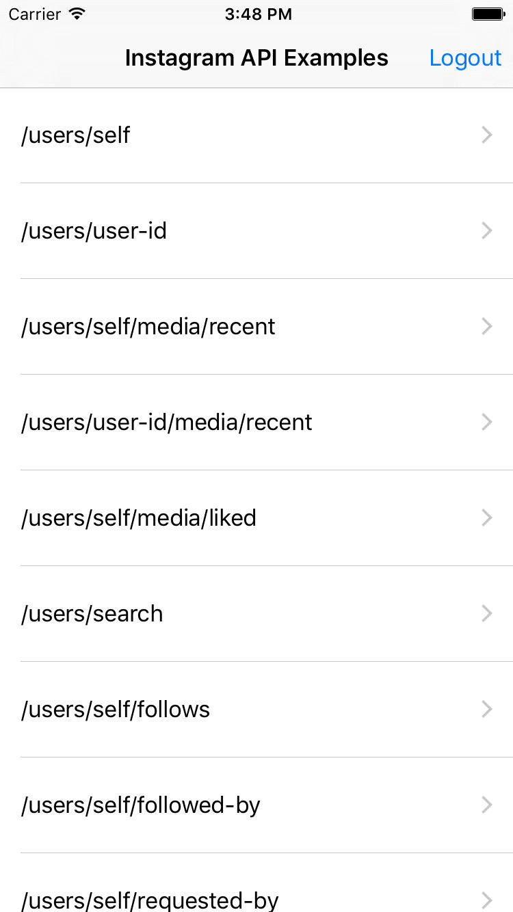
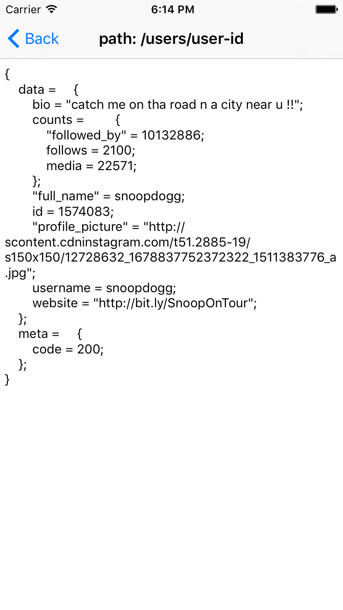

# InstagramSDK

InstagramSDK is open source to use instagram apis.

[](https://travis-ci.org/pisces/InstagramSDK-iOS)
[](http://cocoapods.org/pods/InstagramSDK-iOS)
[](http://cocoapods.org/pods/InstagramSDK-iOS)
[](http://cocoapods.org/pods/InstagramSDK-iOS)

## Example

To run the example project, clone the repo, and run `pod install` from the Example directory first.




#### Info.plist

Add or replace node below to you app info plist.

```XML
    <key>CFBundleURLTypes</key>
    <array>
        <dict>
            <key>CFBundleTypeRole</key>
            <string>Editor</string>
            <key>CFBundleURLName</key>
            <string>orcller</string>
            <key>CFBundleURLSchemes</key>
            <array>
                // Your app scheme of redirect url that you registered instagram application.
                <string></string>
            </array>
        </dict>
    </array>
    <key>NSAppTransportSecurity</key>
    <dict>
        <key>NSExceptionDomains</key>
        <dict>
            <key>cdninstagram.com</key>
            <dict>
                <key>NSIncludesSubdomains</key>
                <true/>
                <key>NSThirdPartyExceptionMinimumTLSVersion</key>
                <string>TLSv1.0</string>
                <key>NSThirdPartyExceptionRequiresForwardSecrecy</key>
                <false/>
            </dict>
            <key>instagram.com</key>
            <dict>
                <key>NSIncludesSubdomains</key>
                <true/>
                <key>NSThirdPartyExceptionMinimumTLSVersion</key>
                <string>TLSv1.0</string>
                <key>NSThirdPartyExceptionRequiresForwardSecrecy</key>
                <false/>
            </dict>
        </dict>
    </dict>
```

#### AppDelegate
```Objective-c
#import "DemoAppDelegate.h"

NSString *const clientId = @"Your client id";
NSString *const clientSecret = @"Your client secret";
NSString *const redirectURL = @"Your redirect url";

@implementation DemoAppDelegate

- (BOOL)application:(UIApplication *)application didFinishLaunchingWithOptions:(NSDictionary *)launchOptions {
    [[InstagramAppCenter defaultCenter] setUpWithClientId:clientId
                                                     clientSecret:clientSecret
                                                      redirectURL:redirectURL];
    return YES;
}

- (BOOL)application:(UIApplication *)application openURL:(NSURL *)url sourceApplication:(NSString *)sourceApplication annotation:(id)annotation {
    if ([[InstagramAppCenter defaultCenter] matchedURL:url])
        return [[InstagramAppCenter defaultCenter] application:application
                                                               openURL:url
                                                     sourceApplication:sourceApplication
                                                            annotation:annotation];
    return YES;
}

@end
```
#### Example for API Call
```Objective-c
- (void)viewDidLoad {
    [super viewDidLoad];
    
    if ([InstagramAppCenter defaultCenter].hasSession) {
        [self loadUserProfile];
    } else {
        [[InstagramAppCenter defaultCenter] loginWithCompletion:^(id result, NSError *error) {
            if (!error) {
                [self loadUserProfile];
            }
        }];
    }
}

- (void)loadUserProfile {
    [[InstagramAppCenter defaultCenter] apiCallWithPath:IGApiPathUsersSelf param:nil completion:^(id result, NSError *error) {
        NSLog(@"result, error -> %@, %@", result, error);
    }];
}
```

#### API Paths
```Objective-c
IGApiPathUsersSelf
IGApiPathUsersUserId
IGApiPathUsersSelfMediaRecent
IGApiPathUsersUserIdMediaRecent
IGApiPathUsersSelfMediaLiked
IGApiPathUsersSearch
IGApiPathUsersSelfFollows
IGApiPathUsersSelfFollowedBy
IGApiPathUsersSelfRequestedBy
IGApiPathUsersUserIdRelationship
IGApiPathUsersUserIdRelationshipPost
IGApiPathMediaMediaId
IGApiPathMediaShortcodeShortcode
IGApiPathMediaSearch
IGApiPathMediaMediaIdComments
IGApiPathMediaMediaIdCommentsPost
IGApiPathMediaMediaIdCommentsCommentId
IGApiPathMediaMediaIdLikes
IGApiPathMediaMediaIdLikesPost
IGApiPathMediaMediaIdLikesDel
IGApiPathTagsTagname
IGApiPathTagsTagnameMediaRecent
IGApiPathTagsSearch
IGApiPathLocationsLocationId
IGApiPathLocationsLocationIdMediaRecent
IGApiPathLocationsSearch
IGApiPathSubscriptions
IGApiPathSubscriptionsDel
```

#### Parameter example for Path
You don't need include oauth2 property as parameter, it will add automatically in sdk.

```Objective-c
// Path contains 'user-id'
@{@"user-id": @(1574083)}

// Path contains 'media-id'
@{@"media-id": @(3)}

// Path contains 'shortcode'
@{@"shortcode": @(3)}

// Path contains 'tag-name'
@{@"tag-name": @"tagname"}

// Path contains 'location-id'
@{@"location-id": @(3)}

// Path IGApiPathUsersSearch or IGApiPathTagsSearch
@{@"q": @"query"}

// Path IGApiPathMediaSearch or IGApiPathLocationsSearch
@{@"lat": @(48.858844), @"lng": @(2.294351)};

```

## Requirements
iOS Deployment Target 7.0 higher

## Installation

InstagramSDK is available through [CocoaPods](http://cocoapods.org). To install
it, simply add the following line to your Podfile:

```ruby
pod "InstagramSDK-iOS"
```

## Author

pisces, hh963103@gmail.com

## License

InstagramSDK is available under the MIT license. See the LICENSE file for more info.
